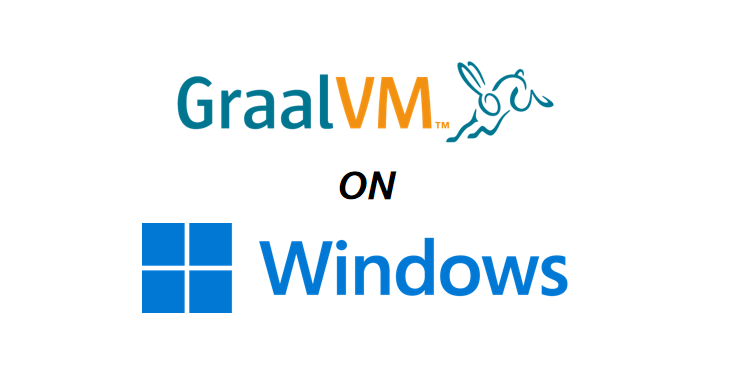
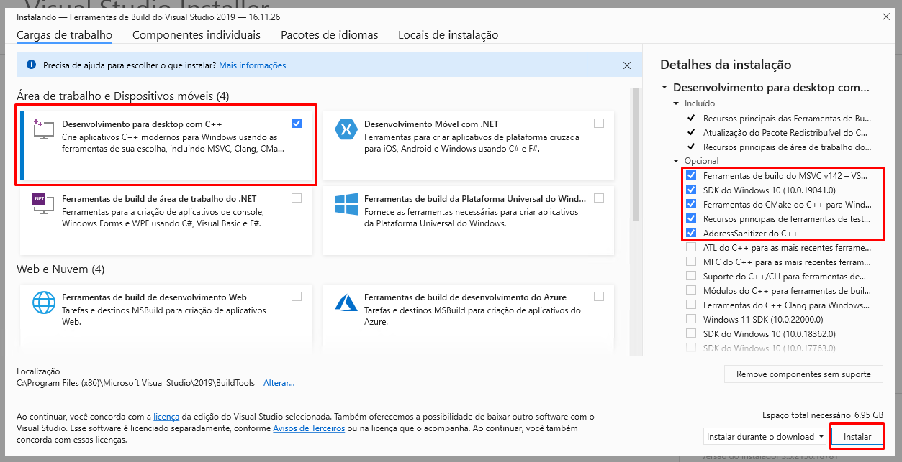
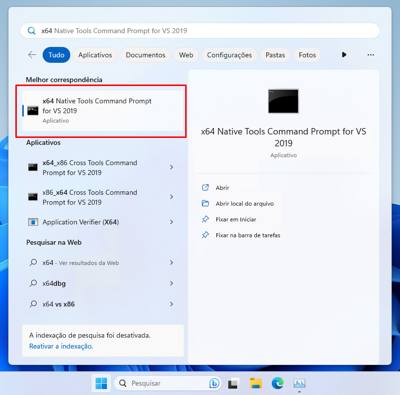
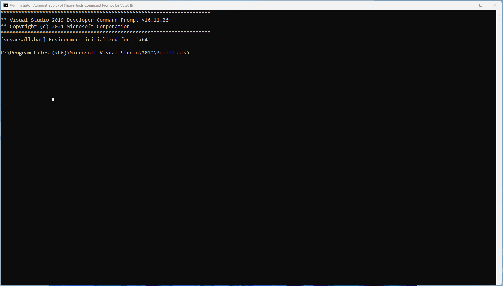
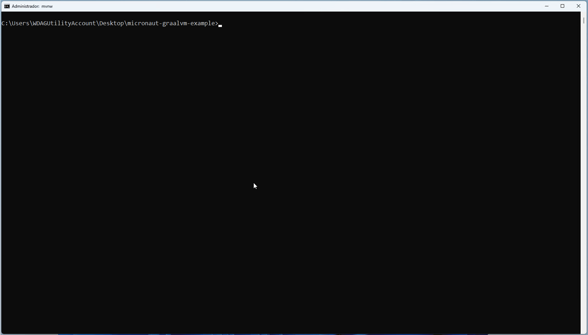

# [PT-BR] Graalvm: Configurando ambiente Windows para geração de imagens nativas



## Introdução

Muitas empresas ainda definem o sistema operacional base de seus desenvolvedores como Windows, isso pode ter vários motivos, eu particularmente creio que seja por conta da facilidade de uso já que se trata do sistema operacional mais usado no mundo ([dados](https://www.statista.com/statistics/268237/global-market-share-held-by-operating-systems-since-2009/#:~:text=Microsoft's%20Windows%20is%20the%20most,OS%20market%20in%20January%202023.)).

Bom vamos diretamente ao que interessa, vou supor que estamos partindo de um ambiente limpo, ou seja uma máquina recém formatada.

## Instalando componentes necessários

Para facilitar as instalações vamos usar o [chocolatey](https://chocolatey.org/).

### Instalando Java

_Todos os comandos devem ser executados no powershell em modo administrador_ 

1- Instalando o chocolatey

```
Set-ExecutionPolicy Bypass -Scope Process -Force; [System.Net.ServicePointManager]::SecurityProtocol = [System.Net.ServicePointManager]::SecurityProtocol -bor 3072; iex ((New-Object System.Net.WebClient).DownloadString('https://chocolatey.org/install.ps1'))
```

2 - Instalando o Java

```
choco install graalvm-java17
```

### Instando a funcionalidade native-image 

1- Feche o powershell aberto anteriormente e abra um novo em modo administrador, isso é apenas para atualizar as variáveis de ambiente carregadas pelo powershell.

2- Execute o comando de instalação abaixo:

```
gu.cmd install native-image
```

### Instando as dependências de compilação com o Visual Studio Build Tools

_Relaxa não vamos instalar o Visual Studio IDE somente as bibliotecas que a compilação nativa precisa para funcionar ;)_

1- Baixe o Visual Studio Build Tools [neste link](https://visualstudio.microsoft.com/thank-you-downloading-visual-studio/?sku=BuildTools&rel=16)

2- Abra o arquivo e aguarde o carregamento do programa

3- Selecione os itens mostrados abaixos e clique em instalar



### Hora do teste !

_Nesse momento vale dar um aviso, toda e qualquer compilação nativa deve ser executada através do prompt X64 Native Tools, existem outras formas, mas essa é a mais simples_

Para nosso exemplo de compilação vamos usar [este projeto](https://github.com/viniciusxyz/micronaut-graalvm-example) super simples, um serviço Micronaut que tem apenas um endpoint `GET /hello` com um "Hello Native", nesse caso é uma aplicação Micronaut, porém poderia ser Quarkus, Spring Boot 3 ou qualquer outro framework compatível com compilação nativa.

1- Abra seu prompt X64 Native Tools



2- Navegue para a pasta do seu projeto e execute o comando de compilação nativa que seu framework disponibiliza, no nosso caso o `mvnw package -Dpackaging=native-image`



3- Após isso basta executar a aplicação e fazer a requisição 



O objetivo desse artigo foi instruir como utilizar a GraalVM e fazer compilações nativas diretamente no Windows, sem precisar usar o WSL, máquinas virtuais ou outros auxiliares.

Este foi meu primeiro artigo e embora existam outros mostrando o mesmo sempre que os via havia algo desatualizado ou instalavam o Visual Studio IDE inteiro o que é desnecessário. Sinta-se à vontade para opinar e para me avisar se algum ponto não ficou claro, deixarei essa página como algo de edição constante.

Estou pensando em criar uma série sobre compilação nativa demonstrando as vantagens e desvantagens nesse processo, me avisem se tiverem interesse !